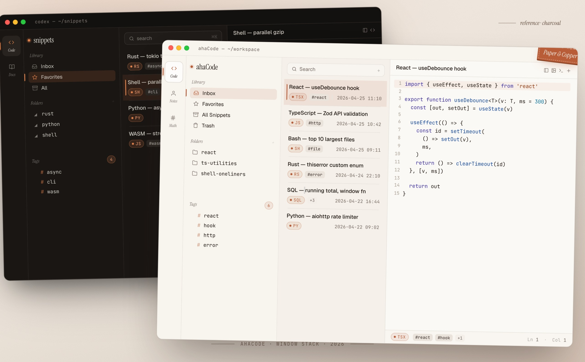

<p align="center">
  
</p>

<h1 align="center">ahaCode</h1>

<p align="center">
  <strong>A local-first code snippets manager for developers.</strong>
  <br>
  Your data stays on your machine as plain Markdown files.
</p>

<p align="center">
  
  
</p>

<p align="center">
  
</p>

---

## About this fork

**ahaCode is a fork of [massCode](https://github.com/massCodeIO/massCode)** by [Anton Reshetov](https://github.com/antonreshetov), licensed under **AGPL-3.0**.

This repository is maintained as an independent, experimental downstream of massCode. It is not endorsed by or affiliated with the upstream project. All original copyrights remain with their respective authors; modifications in this repository are contributed under the same AGPL-3.0 license.

### AGPL-3.0 compliance

- The original `LICENSE` (AGPL-3.0) is preserved unchanged in this repository.
- Upstream attribution is retained in this README, the commit history, and the `CHANGELOG.md`.
- Any source files that contained original copyright headers are preserved.
- Modifications made in this fork are themselves licensed under AGPL-3.0 — if you run a modified version of this software over a network, you must make the corresponding source code available to users of that service, as required by the AGPL.
- The upstream project's trademarks (if any) are not claimed by this fork. The name "ahaCode" is used to clearly distinguish this fork from the upstream app.

If you want the canonical, actively-maintained upstream, go to [massCode](https://github.com/massCodeIO/massCode).

---

## What's in the app

### Code snippets
A focused snippet workspace with multi-level folders, tags, and fragments for organizing reusable code across projects and languages.

- 160+ syntax grammars out of the box (600+ supported via `.tmLanguage`)
- Integrated [Prettier](https://prettier.io) for code formatting
- Real-time HTML & CSS preview
- JSON visualizer for exploring nested structures as interactive graphs
- Export snippets as images with customizable themes

### Markdown vault
Your snippets live as plain `.md` files on disk with YAML frontmatter. The data is readable, portable, and yours.

- **Git-friendly** — track changes and sync via any Git remote
- **Cloud sync** — works with iCloud, Dropbox, Google Drive, Syncthing
- **Live sync** — the app watches the vault and picks up external changes in real time
- **No vendor lock-in**

### Custom themes
Customize the app UI and editor syntax highlighting with JSON theme files. Supports light and dark themes with live reload.

### AI integration via MCP + local RAG
ahaCode ships an in-process [Model Context Protocol](https://modelcontextprotocol.io) server so AI assistants (Claude Desktop, Cursor, Continue, Zed, etc.) can read from and write to your snippet library directly. Two tools are exposed over JSON-RPC:

- **`ingest_snippet`** — create a snippet (name, folder, one or more labelled language/value fragments). The new snippet is automatically embedded and added to the RAG index.
- **`rag_query`** — ask "do I have something like X?" and get the top-K most relevant snippets back, ranked by semantic similarity — not just substring match.

The RAG stack is **100% local** — no API keys, no data leaves the machine:

- **Embeddings**: [`Xenova/bge-small-en-v1.5`](https://huggingface.co/Xenova/bge-small-en-v1.5) runs on-device via [`@huggingface/transformers`](https://github.com/huggingface/transformers.js). First query warms the model (~30 MB); subsequent queries are ~tens of ms.
- **Vector store**: [`sqlite-vec`](https://github.com/asg017/sqlite-vec) — cosine similarity k-NN over an embedded SQLite database. No external service, no network round-trip.
- **Live index**: every snippet create / update / delete syncs to the RAG index automatically, so what you query is always in sync with what you see.

Practical effect: your coding agent can search your private snippet library the way it searches the web, with zero latency and zero data exposure.

---

## Build from source

### Prerequisites

- Node.js `>= 20.16.0`
- pnpm `>= 10.0.0`

### Install

```bash
pnpm install
```

### Develop

```bash
pnpm dev
```

### Build

```bash
# current platform
pnpm build

# specific platform
pnpm build:mac
pnpm build:win
pnpm build:linux
```

---

## Troubleshooting

<details>
<summary>macOS: "ahaCode cannot be opened because the developer cannot be verified"</summary>

ahaCode builds are ad-hoc signed (no paid Apple Developer ID), so Gatekeeper shows a warning on first launch. Bypass it once with any of:

**Right-click → Open** (easiest)
1. In Finder, right-click (or Control-click) `ahaCode.app`
2. Choose **Open**
3. Click **Open** in the dialog. After this the app launches normally every time.

**System Settings (macOS 13+)**
1. Try to open the app once (it will be blocked)
2. Open **System Settings** → **Privacy & Security**
3. Scroll to the bottom, find the ahaCode block, click **Open Anyway**

**Terminal**
```bash
sudo xattr -r -d com.apple.quarantine /Applications/ahaCode.app
```

</details>

---

## License

[AGPL-3.0](./LICENSE)

Copyright (c) 2019–present, [Anton Reshetov](https://github.com/antonreshetov) and contributors to the upstream [massCode](https://github.com/massCodeIO/massCode) project.

Copyright (c) 2026, [sinksmell](https://github.com/sinksmell) and contributors to the ahaCode fork.
